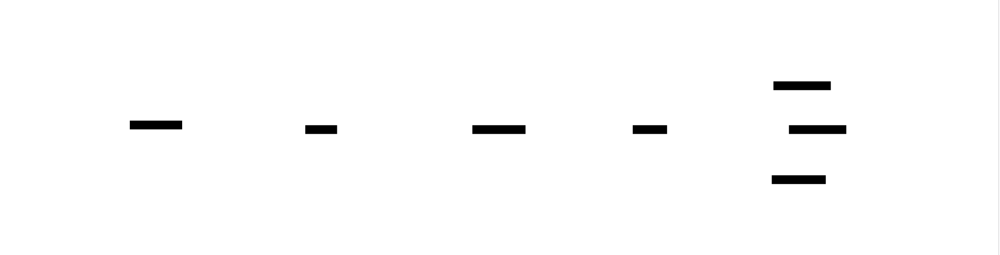
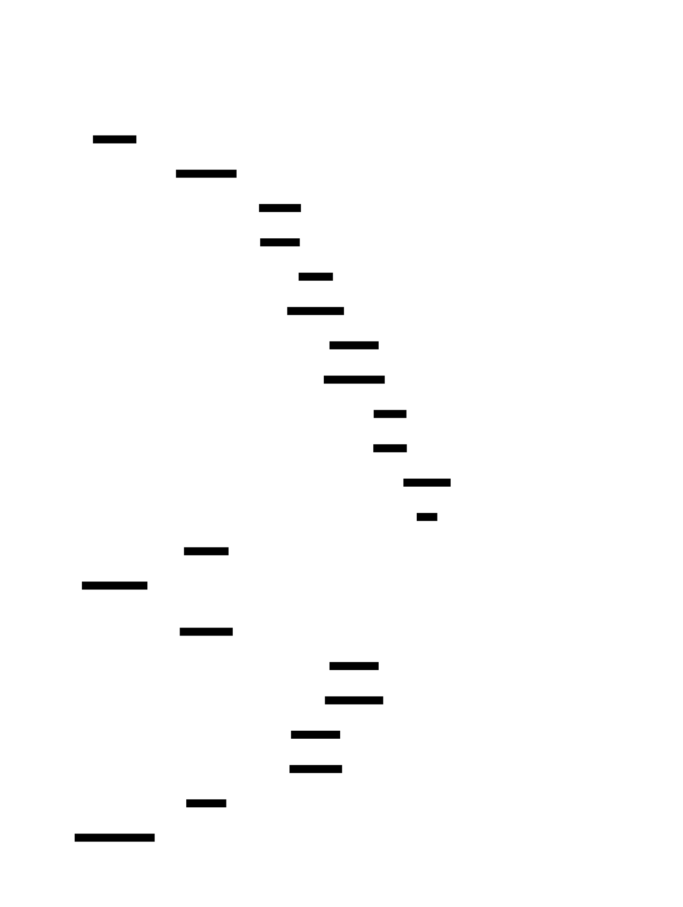

# d2-diagram

[English documentation / 英文文档](./README.md)

`d2-diagram` 是一个 Claude Code skill，用来生成高质量的 [D2](https://d2lang.com/) 图，适合系统和流程类可视化。

它面向那些希望图既清晰、又有设计感、同时结构表达准确的人，而不是退回到 Mermaid、ASCII 草图，或者临时拼出来的非标准记法。

## 为什么要做这个 fork

这个仓库基于 **Altstaq-Apps** 的原始工作修改而来：

- 上游仓库：https://github.com/Altstaq-Apps/d2-diagram-skill

当前 fork 由 **Eryc123Y** 维护。现在这版在保留原始基础之上，继续补了这些内容：

- 更适合公开使用的仓库结构
- 分开的中英文文档
- 默认偏向 ELK 的布局指导
- 内置 UML 2.5.1 关系标记参考
- 更明确的 `skills` CLI 安装入口

## 这个 skill 能做什么

适合用于：

- 系统架构图
- 流程图
- 时序图
- ER 图和数据库 schema 图
- 网络拓扑图
- CI/CD 流水线
- 云基础设施图
- Kubernetes 拓扑图
- 数据流和状态机图
- 组织结构图、类图、路线图

## 内置风格

这个 skill 不是只给一种通用样式，而是内置了几种明确的展示方向：

- **Dark sketch**：适合工程架构图
- **Light sketch**：适合文档和演示里的流程图
- **Minimal formal**：适合 UML 风格和更正式的图
- **Strict UML mode**：当关系语义必须准确时使用

另外，skill 默认倾向 **ELK** 布局；`sequence_diagram` 仍然作为例外处理，因为 D2 对它采用的是不同的内部语义。

## 示例画廊

这个仓库现在展示的是一组真正偏 production-grade 的 example，而不是很小的 toy diagrams。每张图都尽量覆盖真实结构、真实依赖关系，以及更接近生产系统的叙事复杂度。

### Active-active 平台架构图

[Source](./examples/src/dark-architecture.d2) | [Rendered SVG](./examples/rendered/dark-architecture.svg)



### 企业级发布治理流程图

[Source](./examples/src/light-flowchart.d2) | [Rendered SVG](./examples/rendered/light-flowchart.svg)


### 生产级 UML 领域模型

[Source](./examples/src/minimal-uml.d2) | [Rendered SVG](./examples/rendered/minimal-uml.svg)


### Checkout 编排时序图

[Source](./examples/src/sequence-signin.d2) | [Rendered SVG](./examples/rendered/sequence-signin.svg)



## 安装

### 通过 skills.sh / skills CLI 安装

可以直接通过 skills CLI 从 GitHub 安装：

```bash
npx skills add https://github.com/Eryc123Y/d2-diagram-skill --skill d2-diagram
```

全局安装：

```bash
npx skills add https://github.com/Eryc123Y/d2-diagram-skill --skill d2-diagram -g
```

### 手动安装

安装到个人全局目录：

```bash
mkdir -p ~/.claude/skills/d2-diagram
cp -R skill/. ~/.claude/skills/d2-diagram/
```

安装到当前项目：

```bash
mkdir -p .claude/skills/d2-diagram
cp -R skill/. .claude/skills/d2-diagram/
```

## 仓库结构

```text
.
├── README.md
├── README_CN.md
├── examples/
│   ├── rendered/
│   └── src/
└── skill/
    ├── SKILL.md
    └── references/
        ├── d2-examples.md
        ├── d2-style-guide.md
        └── uml-2.5.1-notation.md
```

## 说明

- 安装目标目录的根层必须直接包含 `SKILL.md`。
- `references/` 是 skill 的一部分，复制时要和 `SKILL.md` 一起带上。
- 仓库内置了 UML 2.5.1 关系标记参考，适合需要严格关系语义的 UML 图。
- 这个仓库里的 examples 现在是偏 production-grade 的展示集，用来体现更大的结构、更真实的依赖链和更丰富的关系表达；完整工作流仍然在 `skill/SKILL.md` 和配套 reference 文件里。

## 渲染示例

```bash
d2 --sketch --theme 200 --layout elk input.d2 output.svg
```
